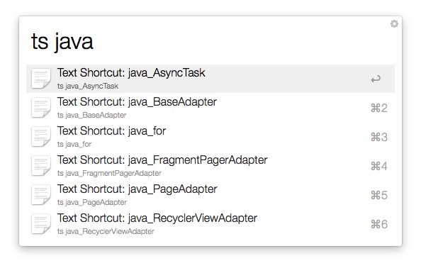
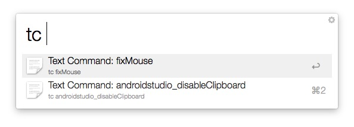

# alfred-workflows-textshortcut

---

#### Version 1.1 - Terminal Commands added!

---

Workflow for Alfred 2 to abbreviate some texts (snippets) and save some terminal commands.

Just type:

`ts [shortcut name]` (for Snippet list)

or 

`tc [shortcut name]` (for Command list)

## Adding new shortcut (or terminal commands):

First, cmd+c (copy) text (or command) you want to use

Then, type:

`ts add [shortcut name]` (or "**tc**", for commands)

After that, you can type:

`ts [shortcut name]` (or "**tc**", for commands)

If you have used "ts", the snippet will be pasted.

If you have used "tc", the command will be executed. 

If the command should run using Administrative Privilegies, you should put the word "**sudo**" before the command you would like to execute.

That is all!

## Removing shortcut (or terminal commands):

Just type:

`ts del [shortcut name]` (or "**tc**", for commands)

If dont remember the shortcut name, just type: `ts del` and all shortcuts will be displayed.

## See some examples:

copy: 

"Best regards, Jon Doe"

`ts add me`

When you are writing an email, type:

`ts me`

TS will paste: "Best regards, Jon Doe"

And, if you can help me, please donate => 
